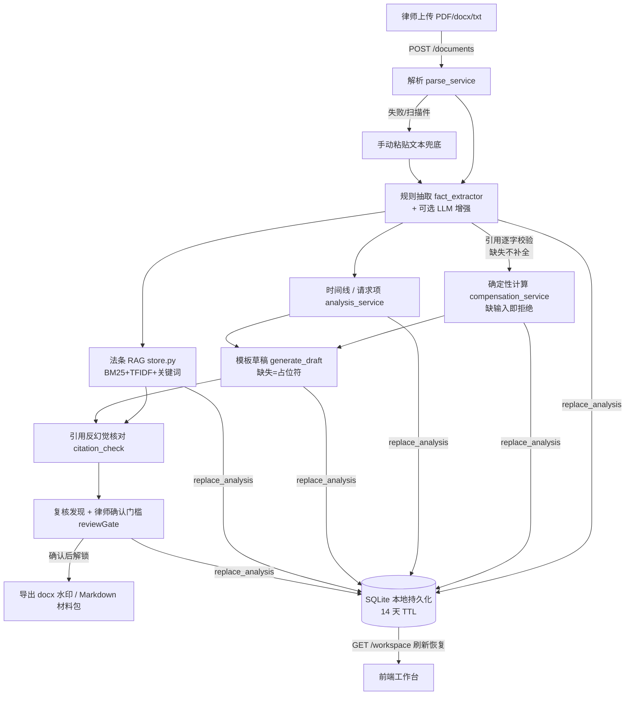
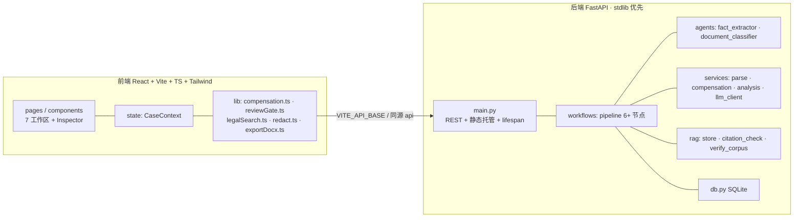

# 架构说明

LawDesk Junior 是一个**律师内部辅助工作台**：把散乱的劳动争议材料整理成可复核的仲裁文书草稿。
核心工程主张是「**不许猜**」——确定性计算 + 来源锚定 + 反幻觉核对 + 律师确认门槛。

## 单地址部署

`npm run build` 产物 `dist/` 由后端 FastAPI 静态托管，用户只需打开 **http://localhost:8000**，
前后端一体，面向非技术用户的双击一键启动（`start_mac.command` / `start_windows.bat`）。

## 端到端数据流（实时案件）

## 分层

## 双实现一致性

金额计算同时有 **TS（`src/lib/compensation.ts`）** 与 **Python（`backend/.../compensation_service.py`）**
两份实现，共享同一套 golden + 边界用例（前端 vitest / 后端 pytest），CI 双侧守护，防止口径漂移。
法条语料 `backend/app/rag/corpus.json` 与前端副本 `src/data/legalCorpus.json` 由 `verify_corpus.py`
校验逐字一致（CI 拦截漂移）。

## 风控护栏（贯穿全链路）

| 护栏 | 位置 | 行为 |
|---|---|---|
| 确定性计算 | `compensation_service` / `compensation.ts` | 公式写死；缺输入/日期冲突/负值 → 拒绝计算，不编数字 |
| 来源锚定 | `fact_extractor` | 每个事实附原文逐字 quote；quote 不在原文 → 强制 needs_review |
| 反幻觉引用 | `citation_check` | 草稿引用的《法律》第X条不在知识库 → 高风险标记 |
| 确认门槛 | `reviewGate.ts` | 高风险发现未清 + 清单未勾 + 无签名 → 不可确认、不可导出 |
| 数据脱敏 | `redact.ts` | 导出前正则兜底脱敏身份证/手机号/账号 |
| 演示边界 | `compliance.ts` | 全局免责声明、草稿水印、「演示样例须核对官方文本」 |

## 升级路径（接口已预留）

- RAG：`store.py` 的 TF-IDF 通道替换为 BGE-M3 / Qwen embedding 即成稠密检索，`search()` 签名不变。
- 抽取：`LLM_PROVIDER=deepseek` 即从纯规则升级为「规则 + LLM 增强（引用逐字校验）」。
- 工作流：顺序管线节点结构已对齐 LangGraph，可平移为 StateGraph。
